<span style="color: red;">This page is automatically generated with RMarkdown and the source file can be found [here](https://github.com/rlimeira/Portfolio/tree/main/Microbiome/SpeG_regulates_rprA).</span>

Analysis performed for:

The spermidine acetyltransferase SpeG regulates transcription of the small RNA RprA

Linda I. Hu, Ekaterina V. Filippova, Joseph Dang, Sergii Pshenychnyi, Jiapeng Ruan, OlgaKiryukhina, Wayne F. Anderson, Misty L. Kuhn, Alan J. Wolfe

bioRxiv 462937; doi: <https://doi.org/10.1101/462937>

# Methods Excerpt From Paper

“To determine whether experimental results were statistically significant, a linear regression was performed, comparing all experimental groups with their respective vector controls. All of the regressions used were set up as follows: the calculated rprApromoter activity was the response variable, the overexpressed plasmids or mutant were the explanatory variable, and time was a random effect. OD was not included as an effect on activity as it is already used in the calculation of activity. Time as a random effect was chosen based on the question asked: Accounting for the effects of time on activity does the experimental group in question signifi- cantly affect overall rprApromoter activity? The significance threshold was set at 0.05. The open source program R (version 3.3.2) and packages “lmerTest”, “ggplot2”, and “moments” were used to visualize and analyze the data (76,77,78,79).”

**Activity = 1 Miller Unit = 1000 x (Abs420 - (1.75 x Abs550)) / (T x V x Abs600) We are then able to disregard OD**

Hypothesis: Treatment groups (plasmids or mutant) have an effect on rprA Promoter activity compared to their respected vector controls.

Note: Although we check for normality of the data during analysis in order to determine the correct test to use for the question asked for the final test selected normal data is not necessary.

# Analysis Details

## Loading Libraries

``` r
library(lmerTest)
library(ggplot2)
library(moments)
```

## Figure 3A

### Taking a look at the data

    #>    Time Cell_Type Activity   OD       AcT
    #> 1  0.50  WT_pSpeG  -113.20 0.06   -6.7920
    #> 2  2.00  WT_pSpeG   557.07 0.20  111.4140
    #> 3  3.50  WT_pSpeG   978.92 0.58  567.7736
    #> 4  4.75  WT_pSpeG  1796.11 0.94 1688.3434
    #> 5  6.00  WT_pSpeG  1312.65 1.53 2008.3545
    #> 6  7.25  WT_pSpeG  1223.74 1.91 2337.3434
    #> 7  8.50  WT_pSpeG  1318.49 2.41 3177.5609
    #> 8  9.75  WT_pSpeG  1416.21 2.58 3653.8218
    #> 9  0.50  WT_pSpeG    -2.93 0.06   -0.1758
    #> 10 2.00  WT_pSpeG   630.85 0.20  126.1700
    #>     Time Cell_Type  Activity   OD         AcT
    #> 111 8.50     WT_VC 2209.6981 2.19 4839.238806
    #> 112 9.75     WT_VC 2375.1228 2.31 5486.533763
    #> 113 0.50     WT_VC   19.2749 0.07    1.349243
    #> 114 2.00     WT_VC  541.4088 0.27  146.180370
    #> 115 3.50     WT_VC 1132.6605 0.56  634.289879
    #> 116 4.75     WT_VC 1983.0903 0.96 1903.766724
    #> 117 6.00     WT_VC 1625.3814 1.56 2535.595050
    #> 118 7.25     WT_VC 1836.6935 1.98 3636.653162
    #> 119 8.50     WT_VC 1882.5694 2.22 4179.303988
    #> 120 9.75     WT_VC 2113.5969 2.50 5283.992243

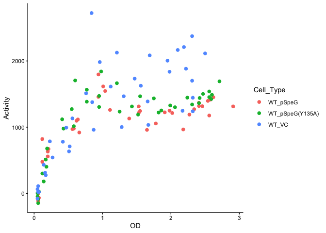<!-- -->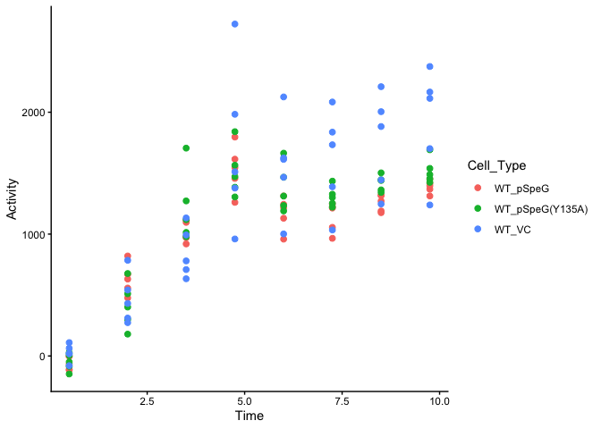<!-- -->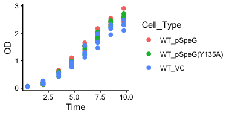<!-- -->

### Checking data “Activity” for normality

``` r
hist(spgdata3A$Activity)
```

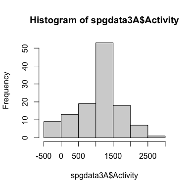<!-- -->

``` r
skewness(spgdata3A$Activity)
#> [1] -0.3586738
kurtosis(spgdata3A$Activity)
#> [1] 2.775568
```

### Accounting for time as a random effect

    #> Linear mixed model fit by REML. t-tests use Satterthwaite's method ['lmerModLmerTest']
    #> Formula: Activity ~ Cell_Type + (1 | Time)
    #>    Data: spgdata3A
    #> 
    #> REML criterion at convergence: 1685.6
    #> 
    #> Scaled residuals: 
    #>     Min      1Q  Median      3Q     Max 
    #> -2.7291 -0.4823 -0.0985  0.4143  3.7234 
    #> 
    #> Random effects:
    #>  Groups   Name        Variance Std.Dev.
    #>  Time     (Intercept) 338869   582.1   
    #>  Residual              74707   273.3   
    #> Number of obs: 120, groups:  Time, 8
    #> 
    #> Fixed effects:
    #>                      Estimate Std. Error       df t value Pr(>|t|)    
    #> (Intercept)          1239.190    210.301    7.411   5.892 0.000488 ***
    #> Cell_TypeSpgvsCtrl   -229.283     61.117  110.000  -3.752 0.000282 ***
    #> Cell_TypeY135AvsCtrl -150.090     61.117  110.000  -2.456 0.015623 *  
    #> ---
    #> Signif. codes:  0 '***' 0.001 '**' 0.01 '*' 0.05 '.' 0.1 ' ' 1
    #> 
    #> Correlation of Fixed Effects:
    #>             (Intr) Cl_TSC
    #> Cll_TypSpgC -0.145       
    #> Cll_TY135AC -0.145  0.500

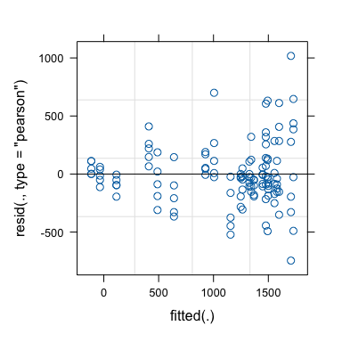<!-- -->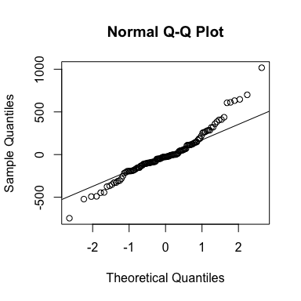<!-- -->

## Figure 3B

### Take a look at the data

    #>     X Time         Cell_Type variable Activity   OD
    #> 1   1  0.5        speE/pSpeG        A     0.00 0.06
    #> 2   2  0.5        speE/pSpeG        B   -45.63 0.06
    #> 3   3  0.5        speE/pSpeG        C    68.44 0.09
    #> 4   4  0.5        speE/pSpeG        D   -67.07 0.06
    #> 5   5  0.5        speE/pSpeG        E    57.03 0.05
    #> 6   6  0.5 speE/pSpeG(Y135A)        A   219.18 0.07
    #> 7   7  0.5 speE/pSpeG(Y135A)        B   105.46 0.06
    #> 8   8  0.5 speE/pSpeG(Y135A)        C   -21.92 0.06
    #> 9   9  0.5 speE/pSpeG(Y135A)        D    85.99 0.07
    #> 10 10  0.5 speE/pSpeG(Y135A)        E    85.99 0.07
    #>       X Time         Cell_Type variable Activity   OD
    #> 111 111 9.75 speE/pSpeG(Y135A)        A  1542.00 2.68
    #> 112 112 9.75 speE/pSpeG(Y135A)        B  1404.23 2.56
    #> 113 113 9.75 speE/pSpeG(Y135A)        C  1467.73 2.36
    #> 114 114 9.75 speE/pSpeG(Y135A)        D  1370.11 2.56
    #> 115 115 9.75 speE/pSpeG(Y135A)        E  1448.21 2.68
    #> 116 116 9.75           speE/VC        A  1499.51 2.34
    #> 117 117 9.75           speE/VC        B  1380.84 2.33
    #> 118 118 9.75           speE/VC        C  1334.80 2.59
    #> 119 119 9.75           speE/VC        D  1534.60 2.48
    #> 120 120 9.75           speE/VC        E  1432.60 2.52

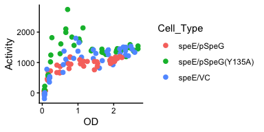<!-- -->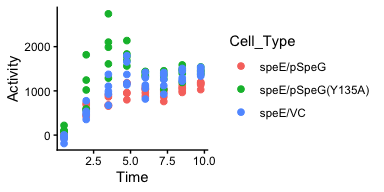<!-- -->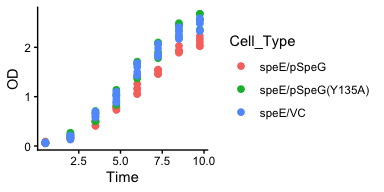<!-- -->

### Checking data “Activity” for normality

``` r
hist(spgdata3B$Activity)
```

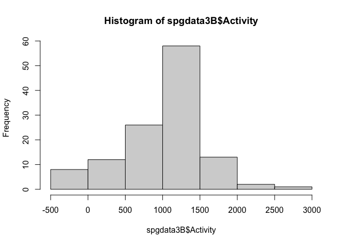<!-- -->

``` r
skewness(spgdata3B$Activity)
#> [1] -0.3075729
kurtosis(spgdata3B$Activity)
#> [1] 3.293223
```

### Accounting for time as a random effect

    #> Linear mixed model fit by REML. t-tests use Satterthwaite's method ['lmerModLmerTest']
    #> Formula: Activity ~ Cell_Type + (1 | Time)
    #>    Data: spgdata3B
    #> 
    #> REML criterion at convergence: 1665.7
    #> 
    #> Scaled residuals: 
    #>     Min      1Q  Median      3Q     Max 
    #> -2.0794 -0.5987 -0.0234  0.4275  4.9015 
    #> 
    #> Random effects:
    #>  Groups   Name        Variance Std.Dev.
    #>  Time     (Intercept) 212956   461.5   
    #>  Residual              64164   253.3   
    #> Number of obs: 120, groups:  Time, 8
    #> 
    #> Fixed effects:
    #>                      Estimate Std. Error       df t value    Pr(>|t|)    
    #> (Intercept)          1004.138    167.999    7.561   5.977    0.000413 ***
    #> Cell_TypeSpgvsCtrl   -196.538     56.641  110.000  -3.470    0.000745 ***
    #> Cell_TypeY135AvsCtrl  301.037     56.641  110.000   5.315 0.000000564 ***
    #> ---
    #> Signif. codes:  0 '***' 0.001 '**' 0.01 '*' 0.05 '.' 0.1 ' ' 1
    #> 
    #> Correlation of Fixed Effects:
    #>             (Intr) Cl_TSC
    #> Cll_TypSpgC -0.169       
    #> Cll_TY135AC -0.169  0.500

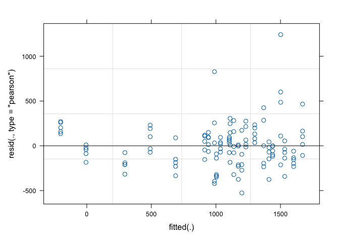<!-- -->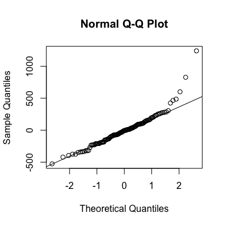<!-- -->

## Figure 1A

### Take a look at the data

    #>         Time Cell_Type Activity     OD
    #> 1  0.1666667  WT/pSpeG   -137.3 0.0585
    #> 2  0.1666667  WT/pSpeG   -101.3 0.0595
    #> 3  0.1666667  WT/pSpeG   -112.3 0.0606
    #> 4  1.5000000  WT/pSpeG    561.6 0.1997
    #> 5  1.5000000  WT/pSpeG    681.3 0.2101
    #> 6  1.5000000  WT/pSpeG    690.0 0.2147
    #> 7  2.5000000  WT/pSpeG   1066.0 0.4339
    #> 8  2.5000000  WT/pSpeG   1109.3 0.4816
    #> 9  2.5000000  WT/pSpeG    968.3 0.4831
    #> 10 3.5000000  WT/pSpeG    909.6 0.7610
    #>    Time Cell_Type Activity     OD
    #> 39 4.75     WT/VC   1026.1 1.2645
    #> 40 6.00     WT/VC   1300.3 1.4261
    #> 41 6.00     WT/VC   1092.5 1.5487
    #> 42 6.00     WT/VC   1126.2 1.5533
    #> 43 7.25     WT/VC   1999.7 1.6728
    #> 44 7.25     WT/VC   1618.0 1.8725
    #> 45 7.25     WT/VC   1579.7 1.8969
    #> 46 8.25     WT/VC   2287.0 1.9013
    #> 47 8.25     WT/VC   1722.2 1.9202
    #> 48 8.25     WT/VC   1787.1 2.0666

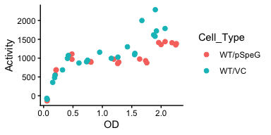<!-- -->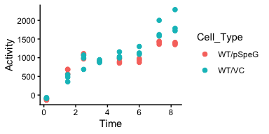<!-- -->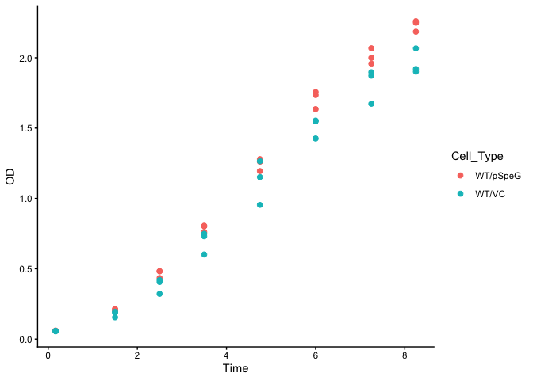<!-- -->

### Checking data “Activity” for normality

``` r
hist(spgdata1A$Activity)
```

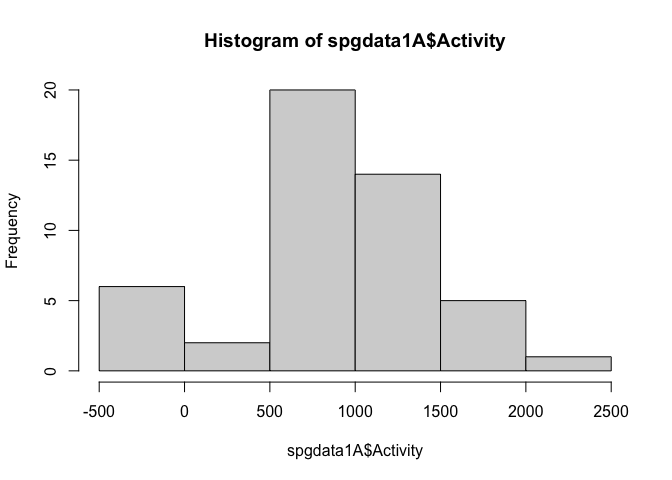<!-- -->

``` r
skewness(spgdata1A$Activity)
#> [1] -0.2193354
kurtosis(spgdata1A$Activity)
#> [1] 3.175003
```

### Accounting for time as a random effect

    #> Linear mixed model fit by REML. t-tests use Satterthwaite's method ['lmerModLmerTest']
    #> Formula: Activity ~ Cell_Type + (1 | Time)
    #>    Data: spgdata1A
    #> 
    #> REML criterion at convergence: 638.1
    #> 
    #> Scaled residuals: 
    #>     Min      1Q  Median      3Q     Max 
    #> -2.1131 -0.4091 -0.1107  0.3281  3.4225 
    #> 
    #> Random effects:
    #>  Groups   Name        Variance Std.Dev.
    #>  Time     (Intercept) 303288   550.7   
    #>  Residual              28589   169.1   
    #> Number of obs: 48, groups:  Time, 8
    #> 
    #> Fixed effects:
    #>             Estimate Std. Error       df t value Pr(>|t|)   
    #> (Intercept) 1012.129    197.743    7.218   5.118  0.00125 **
    #> Cell_Type1  -124.596     48.810   39.000  -2.553  0.01472 * 
    #> ---
    #> Signif. codes:  0 '***' 0.001 '**' 0.01 '*' 0.05 '.' 0.1 ' ' 1
    #> 
    #> Correlation of Fixed Effects:
    #>            (Intr)
    #> Cell_Type1 -0.123

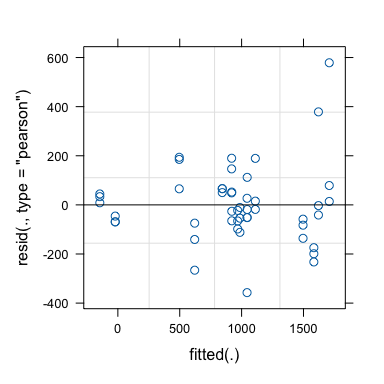<!-- -->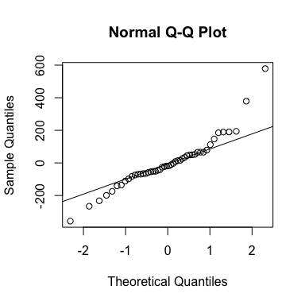<!-- -->

## Figure 1B

### Take a look at the data

    #>         Time Cell_Type Activity   OD
    #> 1  0.1666667      speG    57.38 0.06
    #> 2  0.1666667      speG    10.99 0.06
    #> 3  0.1666667      speG    10.99 0.06
    #> 4  0.1666667      speG    36.10 0.06
    #> 5  0.1666667      speG    10.99 0.05
    #> 6  0.8333333      speG   507.06 0.10
    #> 7  0.8333333      speG   371.76 0.10
    #> 8  0.8333333      speG   452.81 0.10
    #> 9  0.8333333      speG   457.04 0.10
    #> 10 0.8333333      speG   351.85 0.09
    #>     Time Cell_Type Activity   OD
    #> 101  6.6        WT  3287.90 1.97
    #> 102  6.6        WT  2960.83 1.98
    #> 103  6.6        WT  3209.08 1.93
    #> 104  6.6        WT  2533.59 1.90
    #> 105  6.6        WT  1876.65 2.20
    #> 106  7.6        WT  2698.11 2.09
    #> 107  7.6        WT  2772.09 2.13
    #> 108  7.6        WT  2216.92 2.06
    #> 109  7.6        WT  2102.73 2.10
    #> 110  7.6        WT  1480.42 2.42

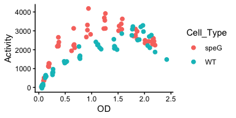<!-- -->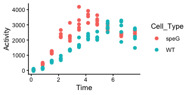<!-- -->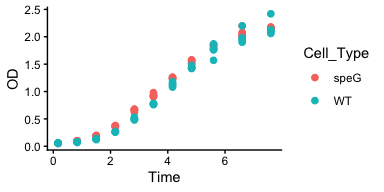<!-- -->

### Checking data “Activity” for normality

``` r
hist(spgdata1B$Activity)
```

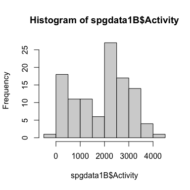<!-- -->

``` r
skewness(spgdata1B$Activity)
#> [1] -0.2433069
kurtosis(spgdata1B$Activity)
#> [1] 1.941201
```

### Accounting for time as a random effect

    #> Linear mixed model fit by REML. t-tests use Satterthwaite's method ['lmerModLmerTest']
    #> Formula: Activity ~ Cell_Type + (1 | Time)
    #>    Data: spgdata1B
    #> 
    #> REML criterion at convergence: 1665.3
    #> 
    #> Scaled residuals: 
    #>     Min      1Q  Median      3Q     Max 
    #> -1.4874 -0.7320 -0.1317  0.5503  3.2791 
    #> 
    #> Random effects:
    #>  Groups   Name        Variance Std.Dev.
    #>  Time     (Intercept) 1052255  1025.8  
    #>  Residual              185699   430.9  
    #> Number of obs: 110, groups:  Time, 11
    #> 
    #> Fixed effects:
    #>             Estimate Std. Error      df t value         Pr(>|t|)    
    #> (Intercept)  1541.12     314.70   10.35   4.897         0.000566 ***
    #> Cell_Type1    636.82      82.17   98.00   7.750 0.00000000000865 ***
    #> ---
    #> Signif. codes:  0 '***' 0.001 '**' 0.01 '*' 0.05 '.' 0.1 ' ' 1
    #> 
    #> Correlation of Fixed Effects:
    #>            (Intr)
    #> Cell_Type1 -0.131

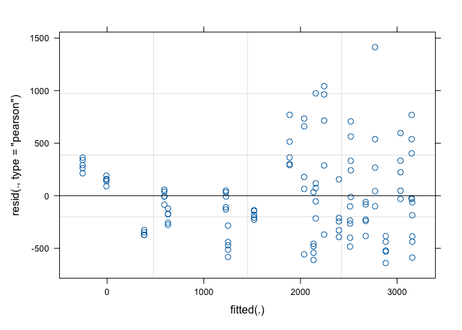<!-- -->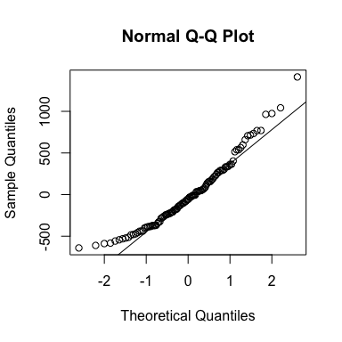<!-- -->

# Conclusion Excerpts From Paper

When SpeG was overexpressed from a plasmid in the reference strain, PrprA activity was reduced compared to the vector control during late exponential growth and during the transition into early stationary phase (OD \>1.0, Fig 1A, linear regression analysis t = -2.553, p = 0.01472). When speGwas deleted, PrprAactivity increased in the isogenic speG mutant compared to its wild-type parent (Fig 1B, linear regression analysis t = 7.750, p = 8.65E-12). Based on these results, we conclude that SpeG inhibits transcription from PrprA.

…

**Fig 3. The effect of overexpressing SpeG or SpeG(Y135A) in WT cells and overexpressing SpeG in the speE mutant on rprApromoter activity.** A. WT cells carrying the PrprA-lacZfusion (AJW3759) were transformed with either pspeG(pCA24n-speG), pspeG(Y135A)(pCA24n-speG(Y135A)), or the VC (pCA24n) and grown in TB7 supplemented with 50 μM IPTG and chloramphenicol to maintain the plasmid. Cell growth and β-galactosidase activity were assayed. The values represent average promoter activity with standard deviations of five independent cultures. B. The isogenic speEmutant was transformed with either pspeG(pCA24n-speG) or the VC (pCA24n) and cell growth and β-galactosidase activity were assayed as described for 3A. The values represent average promoter activity with standard deviations of five independent cultures. Linear regression comparison results on rprApromoter activity were significant for all experimental groups: WT/pspeGversus WT/VC (t = -3.752, p = 0.000282), WT/pspeG(Y135A) versus WT/VC (t = -2.456, p = 0.015623), and speE/pspeGversus speE/VC (t = -3.470, p = 0.000745).
